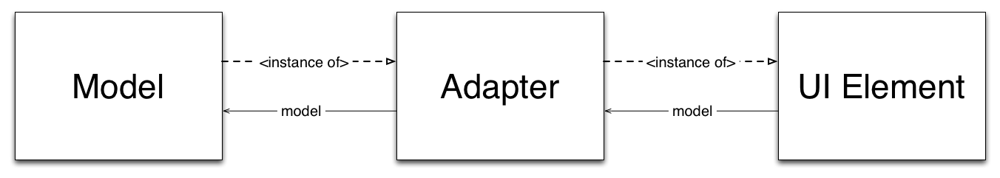

#Spec: a new framework for describing user interfaces

##1\. Introduction

Writing user interfaces is notoriously a tedious task\.It often requires time and a clear understanding of the separation of concerns\. Indeed most of the frameworks mix domain applicative models with widget models\.

*Spec* is a framework for describing user interfaces\. It allows the separation of concerns between the different part of the user interface as expressed in the MVP pattern\.*Spec* emphasis the reuse of the widgets as well as there customization\.

This article goal is to provide an overview of the *Spec* functionalities\. The general purpose of *Spec* will be explained through several examples among sections\.

First the 3 pillars of *Spec* will be explained\. Second we expose how *Spec* reuse subwidgets and how to customize widgets to make them fit the user needs\.Third the API of the *Spec* basic models is detailled as well as how to understand the meta information attached to this API\. The fourth section covers the two dynamic aspects of *Spec*\. The final section is dedicated to the creation of your own *Spec* model\.

##2\.  The heart of Spec

Spec is built around three axes borrowed from the MVP pattern\.Those axes are materialized as three methods: `initializeWidgets`, `initializePresenter`, and `defaultSpec`\.We first detail some necessary terminology before discussing each of these in detail\.

To avoid possible misundertandings due to terminology issues because of overloaded meanings, we first define four terms:
<dl><dt>UI Element
</dt><dd>an interactive graphical element displayed as part of the Graphical User Interface.</dd><dt>UI Model
</dt><dd>an object that contains the state and behavior of one or several UI elements.</dd><dt>Widget
</dt><dd>the union of a UI Element and its UI model.</dd><dt>Basic widgets
</dt><dd>low level widgets like a list, a button, etc. They are not composed of other widgets.</dd></dl>

###2\.1\.  *initializeWidgets* the widgets the MVP View

This takes care of the configuration of the different widgets themselves, without the interaction\.It is used to instantiate the subwidgets and to specify their default values and general behavior\.This focus in this method is to specify how the widgets will look like\.

In general `initializeWidgets` should follow the pattern:

-  widgets instantiation
-  widgets specification
-  set the order of focus

&nbsp;

The code [1\.1\. ](#pattern) is an example of an `initializeWidgets` method\.

**Example of initializeWidgets**

    initializeWidgets
    
    	button := self newButton.
    
    	button label: 'I am a button'.
    	
    	self focusOrder
    		add: button

Note that this method is mandatory\.Each subclass need to override it\.

####2\.1\.1\.  Widget instantiation

The instantiation of a widget can be done in two ways\.First if it is a basic widget \(like a button or a list\) which is instantiated, then the framework provides accesors for them\.The format of this accessors is `new[Widget]`\.By example `newList`, `newText`, etc\.The complete list of available widget creation methods can be found in the class *ComposableModel* in the protocol *widgets*\.

Second if one wants to reuse any subclass of *ComposableModel* the widget needs to be initialized using the `instantiate:` method\.The example [1\.2\. ](#use_of_instantiate) shows how to instantiate a *MessageBrowser*\.

**How to reuse a MessageBrowser widget**

    widget := self instantiate: MessageBrowser.

###2\.2\.  *initializePresenter* the Presenter the MVP Interactor

This takes care of the interactions between the different widgets\.This method specifies the flow of exectution linking the sub widgets all together\.All the interaction between one widget and another is specified here\.

Usually this method is composed of actions to perform when a specific event is received\.Based on value holders, **Spec** event mechanism rely on the value holder announcements\.Value holders provide a single method `whenChangedDo:` to register a block to perform on change\.The propagation of those events build the whole interaction flow\.

Moreover the basic widgets provide a full set of registration methods\.The whole API is described in the section [¿?\. ](#sec_where_to_find_what_I_want)\.

    If a programmer wants his or her widgets to be reused,
    they should provide a comprehensive API.

Note that this method is optional\.

###2\.3\.  *defaultSpec* the View the MVP Presenter

This takes care of the layout of the different widgets\.This class side method is used to specify the position of each sub widgets\.It also specifies how a widget reacts when the window is resized\.

Multiple layouts can be described\.Then when the widget is built a specific layout can be specified\.

This method is on class side because usually all the instances of a same user interface have the same layout\.But the lookup for the spec method to use starts on instace side\.This way a class can have a more specific layout depending of the instance state\.

####2\.3\.1\.  Pragmas

As previously said, multiple views can be described for the same user interface\.In order to retrieve the correct method to apply, the spec methods are flagged with a pragma\.

The pragma can be `<spec: default>` for the view to use by default, or `<spec>` for the other views\.

####2\.3\.2\.  Examples

This section provides a list of examples about the constructions of layouts\.It starts with a [basic](#layout_basic_example) example\.Then two examples are given about the creation of [rows and columns](#layout_rows_and_column_layout)\.Now that rows and columns do not have any mystery, two other examples explain how to set a [fix size](#layout_set_size_pixels) for rows and columns\.Another example explains how to specify a widget [proportions](#layout_percentage)\.The last example presents the [expert](#layout_expert) mode in case everything else failed\.This section ends with a little [explanation](#layout_specify_layout) of how to specify which view to use and where to find the complete API\.

The simpliest example is to just render one widget\.The example [1\.3\. ](#ex_layout1) presents such a layout\.

**Layout with only one widget**

    ^ SpecLayout composed
    	add: #myWidget;
    	yourself

The symbol `myWidget` refers to an instance side method returning a widget\.Note that by default, a widget will take all the space available\.

---

Often user interfaces can be describes in rows and columns\.The example [1\.4\. ](#ex_layout_row) sows how to build a row of widgets\.

**Row of widgets**

    ^ SpecLayout composed
    	newRow: [ :row |
    		row
    			add: #myFirstWidget;
    			add: #mySecondWidget
    	];
    	yourself

Now having the widgets rendered as a column is very similar as show in the example [1\.5\. ](#ex_layout_column)

**Column of widgets**

    ^ SpecLayout composed
    	newColumn: [ :column |
    		column
    			add: #myFirstWidget;
    			add: #mySecondWidget
    	];
    	yourself

---

The height of row, as well as the width of a column, can be specified to prevent it to take all the space available\.The example [1\.6\. ](#ex_row_height) shows how to specify the height of a row in pixels while the example [1\.7\. ](#ex_column_width) how to specify the column width\.

**Row of 30px**

    ^ SpecLayout composed
    	newRow: [ :row |
    		row
    			add: #myFirstWidget;
    			add: #mySecondWidget
    	] height: 30;
    	yourself

**Column of 30px**

    ^ SpecLayout composed
    	newColumn: [ :column |
    		column
    			add: #myFirstWidget;
    			add: #mySecondWidget
    	] width: 30;
    	yourself

Note that it is a bad habit to hardcode the size of the widgets\.Methods are available on *ComposableModel* providing some default size like the width of a button\.If one wants to use his or her own widget size, he or she should not forget to take in account the current font size\.

---

It is also possible to specify the percentage of the container a widget should occupy\.This way the widget size will change accordingly when the window is resized by example\.To do so, the four sides of a widget can be specified as shown in the example [1\.8\. ](#ex_layout_proportional)\.

**Square centered and half the size of its container**

    ^ SpecLayout composed
    	add: #square top: 0.25 bottom: 0.25 left: 0.25 right: 0.25;
    	yourself

Note that the value provided as argument moves the corresponding side toward the center of the widget\.Note also that the argument can be an integer if the offset has to be a fixed number of pixels\.

---

The previous examples should cover most of the cases\.In case it does not, there is a last way to specify a widget position\.

The method `add: aWidget origin: originPoint corner: cornerPoint offsetOrigin: ooPoint offsetCorner: ocPoint` allows one to add a widget from origin point to cornerPoint\.Those two points represents respectively the top left corner and the bottom right corner of the widget\.The points represent a percentage of the container \(so the coordinates <u>must</u> be between *0* and *1* \)\.

In addition to those points, two offsets can be specified\.They represent the number of pixels the origin, respectively the corner, should be moved\.This approach is similar to the ProportionalLayout of **Morphic**\.

The exemple [1\.9\. ](#ex_layout_expert) show how to add a widget as a toolbar\.The widget should take all the window width, but should be only 30px height\.

**Expert Mode: Toolbar**

    ^ SpecLayout composed
    	add: #toolbar origin: 0@0 corner: 1@0 offsetOrigin: 0@0 offsetCorner: 0@30;
    	yourself

---

As explained in the section [1\.2\.3\.1\. ](#subsec_pragma), a widget can have multiple views\.So when a sub widget layout is specified, the view to use for this sub widget can e specified\.

All the methods seen in the previous examples come with a variant used to specidy the view selector to use\.By example, for `add:` there is `add:withSpec:`\.All the methods can be found in the *commands* and *commands\-advanced* protocols of **SpecLayout**\.

##3\.  Where to find what I want

##4\.  Spec the Dynamic

Having an user interface with a well known number of sub widgets and a static layout should now sounds easy\. But an user interface is often more than just that\. There are two situations where you need more\. First it happens that the layout of the user interface need to be changed at runtime to match the execution context\.Second if sub widgets are added or removed at runtime\. Then the programmer need to be able to parametrize those new sub widgets on the fly\.

###4\.1\.  Dynamic modification of the layout

Changing a widget layout at runtime is quite easy\.It consists of three steps: creating the new layout, setting the needed flag, and build the widget again with the newly created layout\.

The snippet [1\.10\. ](#rebuildDynamically) shows how to simply rebuild a widget with a new layout\.

**Rebuild a widget at run time**

    rebuildWithNewLayout
    	| newLayout |
    
    	newLayout := self newLayoutCreatedDynamically.
    	self needRebuild: false. "tells the interpreter to keep my current ui element"
    	self buildWithSpecLayout: newLayout. "rebuilds me with the new layout"

One widget can also keep the ui elements of its sub widgets which did not need to be rebuilt\.The message `needRebuild: false` need to be sent to any of those sub widgets\.

###4\.2\.  Dynamic add and removal of subwidgets

If an user interface needs a various number of sub widgets that can not be predicted at compilation time, another approach is needed\.When one faces this scenario, he or she should subclass `DynamicComposableModel` for his or her application\.

Then the instantion of the sub widgets is a bit different\.The method `instantiateModels:` should be used\.It takes as argument an array of pairs\.Each pair is composed of the unique name of the widget as key, and the name of the widget class as value\.Then a widget can be accessed by sending a message whose selector is the widget name\.

By example, if a widget named `button` is created, the this widget can be accessed by calling `self button` as shown in the example [1\.11\. ](#ex_dynamic_creation)\.

**Dynamic creation of a widget**

    self instantiateModels: { 'button' -> 'ButtonModel' }.
    	self button label: 'Click me'.

Note that the instantiation array can also be an array of pairs\. The previous example could be written

**Dynamic creation of a widget**

    self instantiateModels: #( button ButtonModel ).
    	self button label: 'Click me'.

####4\.2\.1\.  Example

Thanks to the *Spec* capability to dynamically instantiate widgets, it is also possible to prototype an user interface\.From within any workspace a new user interface can be easily defined\.

The example [1\.13\. ](#ex_prototyping) shows how to easily and quickly design a popup window asking for an input\.

**Popup requiring a simple input**

    view := DynamicComposableModel new
    	instantiateModels: #(label LabelModel text TextInputFieldModel);
    	extent: 300@90;
    	title: 'Choose your project'
    	yourself.
    	
    toolbar := OkToolbar new
    	okAction: [ regex := view text text ];
    	yourself.
    	view focusOrder add: view text.
    view text bindKeyCombination: Character cr asKeyCombination  toAction: [ toolbar triggerOkAction ].
    view label text: 'Packages:'.
    view text
    	autoAccept: true;
    		entryCompletion: nil;
    	ghostText: '.*'.
    view openDialogWithSpecLayout: (SpecLayout composed
    		newRow: [ :r | r add: #label width: 75; add: #text ];
    yourself))
    	toolbar: toolbar;
    	centered;
    	modalRelativeTo: World.

The result can be seen in Figure [1\.1\. ](#fig_popup)\.

##5\.  Writing my own basic widget

In the case of a basic widget missing, the following section will explain how to extend the *Spec* framework\.Creating a new widget is essentially three steps: writing a new model, writing an adapter, and updating or creating a specific binding\.

Before explaining the details of how to create a new widget, we will explain how the creation of a widget is done\.It will expose the different actor and provide a clearer understanding of who is doing what\.

###5\.1\.  Overall view of the build of a widget

When a basic widget is built, like the others widget, the model default spec method is called\.But in this case, instead of providing a layout, it builds an adapter\.Depending of the bindings set currently used, it can provide different kind of adapter \(an adapter for Morphic, one for Seaside, etc\.\)\.

This adapter when created will instantiate a UI framework specific widget \(a PluggableListMorph for a MorphicListAdapter\)\.This is this framework specific widget which will be returned by the model and rendered\.

The figure [1\.2\. ](#model_adapter_uielement) shows the relationship between those objects\.

###5\.2\.  The Model

The new model needs to be a subclass of **AbstractWidgetModel**\.The name of a model is composed of the new basic widget concept \(like list, or button\) and of the word *Model*\.

The model stores all the state of a widget\.

**Examples of state**

    index for a list, the label of a button, the action to perform when a text is validated in a text field

The states are stored inside value holders\. They are later used to propagate state changes and thus create the interaction flow\.

**Storing an instance variable as a Value Holder**

    index := 0 asValueHolder.

Then for each state \(in other words instance variable\) three methods should be defined: the getter, the setter, and the registration method\.The first two should be in the protocol *protocol* while the registration method should be in *protocol\-events*\.

**Example of mutators for index**

    protocol: protocol
    index
    	index value
    
    protocol: protocol
    index: anInteger
    	index value: anInteger
    
    protocol: protocol-events
    whenIndexChanged: aBlock
    	index whenChangedDo: aBlock

The last step to define a new model is to implement on class side a method `adapterName`\.The method should be in the protocol *spec* and should return a symbol\.The symbol should be composed with the concept of the widget \(like list, or button\) and the word *Adapter* like **ListAdapter**\.

Since a same model can hold the state of different views \(like in the MVC pattern\), multiple adapters can be refering to the same model\.Due to this, the way to update the adapters uses the dependents mechanism\.In fact the message `change: selector with: aCollection` is used to call the message *selector* with the arguments *aCollection* to the adapter\.The propagation is done regardless of the number of adapters\.

###5\.3\.  The Adapter

The adapter name is composed of the framework name \(like Morphic\) and the name of the adapter it is implementing \(like ListAdapter\)\.The adapter is an object used to connect a framework specific ui element and a framework independent model\.The only mandatory method for an adapter is `defaultSpec` on the class side\.

But since the adapter is bridging the gap between the ui element and the model, the adapter often needs to forward the queries form the ui element to the model\.The other way around, since the model is holding the state, the adapter is used to update the ui element state for the model\.

The methods involved in the communication with the model should be in the protocol *spec protocol* while the methods involded in the ui element should be *widget API*\.To communicate with the ui element, the adapter methods use the method `widgetDo:`\.This method execute the block provided as argument only if the ui element has already been created\.

###5\.4\.  The Bindings

The bindings is an object use to resolve the adapter name at run time\.This way a same model can be used with several frameworks\.

Adding the new adapter to the default adapter is quite simple\.It requires to update two methods: `initializeBindings` in **SpecAdapterBindings** and `initializeBindings` in the framework specific adapter class \(like **MorphicAdapterBindings** by example\)\.Once it is done, the bindings should be initialized again with the following snippet:

**Reset the bindings**

    SpecInterpreter hardResetBindings

