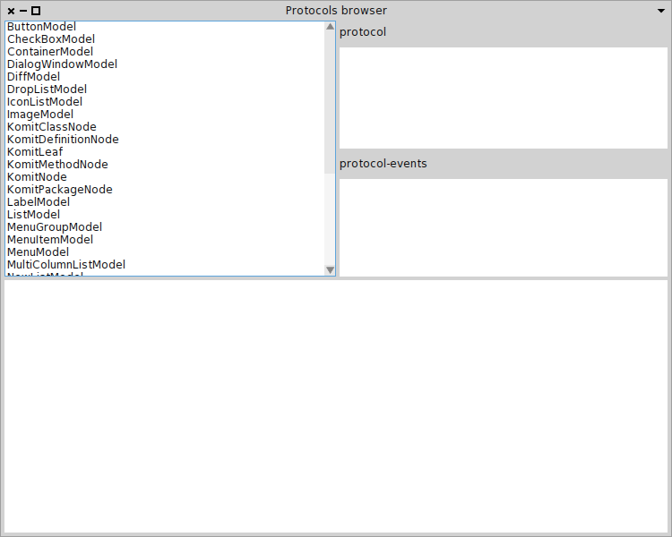

##1\.  Defining and Reusing UIs with *Spec*

This section introduces an example of how to define and reuse 
*Spec* user interfaces\. The example UI that is built will serve to browse the public API of all the basic widgets offered by 
*Spec*\.
This API is further documented in 
[¿?](#sec_where_to_find_what_I_want)\.
In this section we do not detail the different parts of 
*Spec* yet, for a more in\-depth discussion on the heart of 
*Spec*  we refer to 
[¿?](#sec_heart_of_spec)\.

The example is structured in four parts\.
First, a list UI named  
**ModelList** that is dedicated to render the subclasses of the 
*AbstractWidgetModel* class is created\.
Second, a UI composed of a list and a label is defined and named 
**ProtocolList**\.
Third, a protocol viewer is defined by combining a 
**ModelList** with two 
**ProtocolList** to browse the 
*protocol* and 
*protocol\-events* methods\.
Finally a protocol browser is made by reusing a protocol viewer and adding a text zone\.

###1\.1\.  The ModelList

Creating a specific UI always starts with the subclassing of 
**ComposableModel**\.
Each sub widget is stored into an instance variable of the newly created class\.
The snippet 
[1\.1](#ex_model_list) shows the definition of this ModelList class\.

**ModelList definition**

    ComposableModel subclass: #ModelList
    	instanceVariableNames: 'list'
    	classVariableNames: ''
    	category: 'Spec-Examples'

The first required step then is to instantiate and define the sub widgets\.
This step is done in the method 
`initializeWidgets` as shown in the code 
[1\.2](#ex_modelList_initializeWidgets)\. It creates the list and populates it with the required classes, in alphabetical order\.
More details on the use of the 
`initializeWidgets` method are given in 
[¿?](#subsec_initializeWidgets)\.

**Implementation of ModelList>>\#initializeWidgets**

    initializeWidgets
    
    	list := self newList.
    	
    	list items: (AbstractWidgetModel allSubclasses 
    		sorted: [:a :b | a name < b name ]).
    		
    	self focusOrder add: list

The second required step is to define a layout, which is done on the class side\.
Since there is here only one sub widget, the layout is quite simple, as shown in the code in 
[1\.3](#ex_modelList_layout)\.
It simply returns a layout that contains only the list\.
More details on the use of this method are given in 
[¿?](#subsec_layout)\.

**ModelList layout**

    ModelList class>>#defaultSpec
    	<spec: #default>
    	
    	^ SpecLayout composed
    		add: #list;
    		yourself

The three last methods to define on ModelList are a getter, a method to display the UI title and a method to register to list selection changes\.
The code 
[1\.4](#ex_modelList_others) shows the implementation of these three methods and their protocols\.

**ModelList other methods**

    "accessing"
    list
    	^ list
    	
    "protocol"
    title
    
    	^ 'Widgets'
    	
    "protocol-events"
    whenSelectedItemChanged: aBlock
    
    	list whenSelectedItemChanged: aBlock

The first UI is now done\.
The result can be seen by executing the following snippet of code: 
`ModelList new openWithSpec`\.

###1\.2\.  The ProtocolList

The next user interface is the protocol list\.
This UI combines two sub widgets: a list and a label\.
The class definition is similar to the code above, as can be seen in 
[1\.5](#ex_protocolList_definition)\.

**ProtocolList definition**

    ComposableModel subclass: #ProtocolList
    	instanceVariableNames: 'label protocols'
    	classVariableNames: ''
    	category: 'Spec-Examples'

The 
`initializeWidgets` method for this UI is quite similar to the method in ModelList, as the code in 
[1\.6](#ex_protocolList_init) shows\.

**ProtocolList implementation of initializeWidgets**

    initializeWidgets
    
    	protocols := self newList.
    	label := self newLabel.
    	
    	label text: 'Protocol'.
    	protocols	displayBlock: [ :m | m selector ].
    	
    	self focusOrder add: protocols

The layout method is quite different though\.
Now the sub widgets need to be placed more specifically than in the previous example\.
The code 
[1\.7](#ex_protocolList_layout) shows how to build a column with the label on top and the list taking all the space that is left\.

**ProtocolList layout**

    defaultSpec
    	<spec: #default>
    
    	^ SpecLayout composed
    		newColumn: [ :column |
    			column
    				add: #label
    				height: self toolbarHeight;
    				add: #protocols ];
    		yourself

The remaining methods are getters, sub widget delegation methods, a method to display the title, and a method to register to list selection changes\.
The code 
[1\.8](#ex_protocolList_others) shows the implementations of these methods as well as their protocol\.

**ProtocolList other methods**

    "accessing"
    label
    	^ label
    	
    "accessing"
    protocols
    	^ protocols
    	
    "protocol"
    items: aCollection
    
    	protocols items: aCollection
    	
    "protocol"
    label: aText
    
    	label text: aText
    	
    "protocol"
    resetSelection
    
    	protocols resetSelection
    	
    "protocol"
    title
    
    	^ 'Protocol widget'
    	
    "protocol-events"
    whenSelectedItemChanged: aBlock
    
    	protocols whenSelectedItemChanged: aBlock

The 
**ProtocolList** UI can be seen by evaluating 
`ProtocolList new openWithSpec`\.

###1\.3\.  The ProtocolViewer

The third user interface is a composition of the two previous user interfaces\.
It is composed of a 
**ModelList** and two 
**ProtocolList**\.
When a model class is selected, the methods in the protocol 
*protocol* and in the protocol 
*protocol\-events* are listed\.

The class has now three instance variables: 
`models` to store the 
**ModelList**, 
`protocols` to store the 
**ProtocolList** for the protocol 
*protocol*, and 
`events` to store the 
**ProtocolList** for protocol 
*protocol\-events*\.
The code in 
[1\.9](#ex_viewer_definition) shows the definition of the class 
**ProtocolViewer**\.

**ProtocolViewer definition**

    ComposableModel subclass: #ProtocolViewer
    	instanceVariableNames: 'models protocols events'
    	classVariableNames: ''
    	category: 'Spec-Examples'

The 
`initializeWidgets` method now uses a different way to initialize the sub\-widgets of the UI\. 
This is because it does not use basic widgets but instead reuses the user interfaces we defines previously\.
The remainder of the method is quite similar to the previous implementation, as shown in the code in 
[1\.10](#ex_viewer_initializeWidgets)\.

**Implementation of ProtocolViewer>>\#initializeWidgets**

    initializeWidgets
    
    	models := self instantiate: ModelList.
    	protocols := self instantiate: ProtocolList.
    	events := self instantiate: ProtocolList.
    	
    	protocols	label: 'protocol'.
    	events label: 'protocol-events'.
    		
    	self focusOrder 
    		add: models;
    		add: protocols;
    		add: events

The layout puts the sub widgets in one column, with all sub widgets taking the same amount of space\.
The code in 
[1\.11](#ex_viewer_layout) shows the implementation of this layout\.

**ProtocolViewer column layout**

    defaultSpec
    	<spec: #default>
    	
    	^ SpecLayout composed
    		newColumn: [ :column |
    			column 
    				add: #models; 
    				add: #protocols; 
    				add: #events ];
    		yourself

To describe the interactions between the sub widgets, the method 
`initializePresenter` needs to be defined\.
Here, it specifies that when a class is selected, the selections in the protocol list are reset and both protocol lists are populated\.
Additionally, when a method is selected in one protocol list, the selection in the other list is reset\.
The implementation of this method is exposed in code 
[1\.12](#ex_viewer_presenter)\.
More details on the 
`initializePresenter` method are given in 
[¿?](#subsec_initializePresenter)\.

**ProtocolViewer sub widget interactions**

    initializePresenter
    
    	models whenSelectedItemChanged: [ :class |
    		self resetProtocolSelection.
    		self resetEventSelection.
    		class
    			ifNil: [ 
    				protocols items: #().
    				events items: #() ]
    			ifNotNil: [ 
    				protocols items: (self methodsIn: class for: 'protocol').
    				events items: (self methodsIn: class for: 'protocol-events') ] ].
    	
    	protocols whenSelectedItemChanged: [ :method | method ifNotNil: [ self resetEventSelection ] ].
    	events whenSelectedItemChanged: [ :method | method ifNotNil: [ self resetProtocolSelection ] ].

The remaining methods are getters, methods to delegate to sub widgets, one method to compute the methods in a specific class for a specific protocol, and methods to register to sub widget events\.
Those methods are given in the code in 
[1\.13](#ex_viewer_others)\.

**ProtocolViewer other methods**

    "accessing"
    events
    	^ events
    
    "accessing"
    models
    	^ models
    
    "accessing"
    protocols
    	^ protocols
    
    "private"
    methodsIn: class for: protocol
    
    	^ (class methodsInProtocol: protocol)
    		sorted: [ :a :b | a selector < b selector ]
    
    "protocol"
    resetEventSelection
    
    	events resetSelection
    
    "protocol"
    resetProtocolSelection
    
    	protocols resetSelection
    
    "protocol"
    title
    
    	^ 'Protocol viewer'
    
    "protocol-events"
    whenClassChanged: aBlock
    
    	models whenSelectedItemChanged: aBlock
    
    "protocol-events"
    whenEventChangedDo: aBlock
    
    	events whenSelectedItemChanged: aBlock
    
    "protocol-events"
    whenProtocolChangedDo: aBlock
    
    	protocols whenSelectedItemChanged: aBlock

As previously, the result can be seen by executing the following snippet of code: 
`ProtocolViewer new openWithSpec`\.

###1\.4\.  Protocol Editor

The last user interface reuses a 
**ProtocolViewer** with a different layout and adds a text zone to edit the source code of the selected method\.
The class definition can be seen in code in 
[1\.14](#ex_browser_definition)\.

**ProtocolBrowser definition**

    ComposableModel subclass: #ProtocolEditor
    	instanceVariableNames: 'viewer text'
    	classVariableNames: ''
    	category: 'Spec-Examples'

The 
`initializeWidgets` implementation is shown in the code in 
[1\.15](#ex_browser_initializeWidgets)\.

**ProtocolEditor>>\#initializeWidgets**

    initializeWidgets
    
    	text := self newText.
    	viewer := self instantiate: ProtocolViewer.
    	
    	text aboutToStyle: true.
    
    	self focusOrder 
    		add: viewer;
    		add: text

The layout is more complex than the previous layouts\.
Now the user interface mainly lays out widgets that are contained in its 
`viewer` sub widget \(the list of models and the two protocol browsers\)\.
The layout is based on a column whose first row is divided in columns\.
The implementation of this method is shown in code in 
[1\.16](#ex_browser_layout)\.

**ProtocolBrowser layout**

    defaultSpec
    	<spec: #default>
    	
    	^ SpecLayout composed
    		newColumn: [ :col | 
    			col 
    				newRow: [ :r | 
    					r 
    						add: #(viewer models);
    					 	newColumn: [ :c | 
    							c 
    								add: #(viewer protocols);
    								add: #(viewer events) ] ];
    				add: #text
    		];
    		yourself

The 
`initalizePresenter` method is used to make the text zone react to a selection in the lists\.
When a method is seleted, the text zone updates its contents to show the source code  of the selected method\.
The implementation of this method is detailled in the code in 
[1\.17](#ex_browser_presenter)\.

**ProtocolBrowser interactions**

    initializePresenter
    
    	viewer whenClassChanged: [ :class | text behavior: class ].
    
    	viewer whenProtocolChangedDo: [ :item | 
    		item 
    			ifNil: [ text text: '' ]
    			ifNotNil: [ text text: item sourceCode ] ].
    	viewer whenEventChangedDo: [ :item | 
    		item 
    			ifNil: [ text text: '' ]
    			ifNotNil: [ text text: item sourceCode ] ]

The other methods are two getters, a method to set the default size, and a method to set the UI title\.
Their implemenations are detailled in code 
[1\.18](#ex_browser_others)\.

**ProtocolBrowser remaining methods**

    "accessing"
    text
    	^ text
    
    "accessing"
    viewer
    	^ viewer
    
    "protocol"
    initialExtent
    
    	^ 750@600
    
    "protocol"
    title
    
    	^ 'Protocols browser'

This finishes the protocol browser\.
The final user interface can be opened with the following snippet: 
`ProtocolBrowser new openWithSpec`\.
The result can be seen in figure 
[1\.1](#fig_protocol_browser)\.

